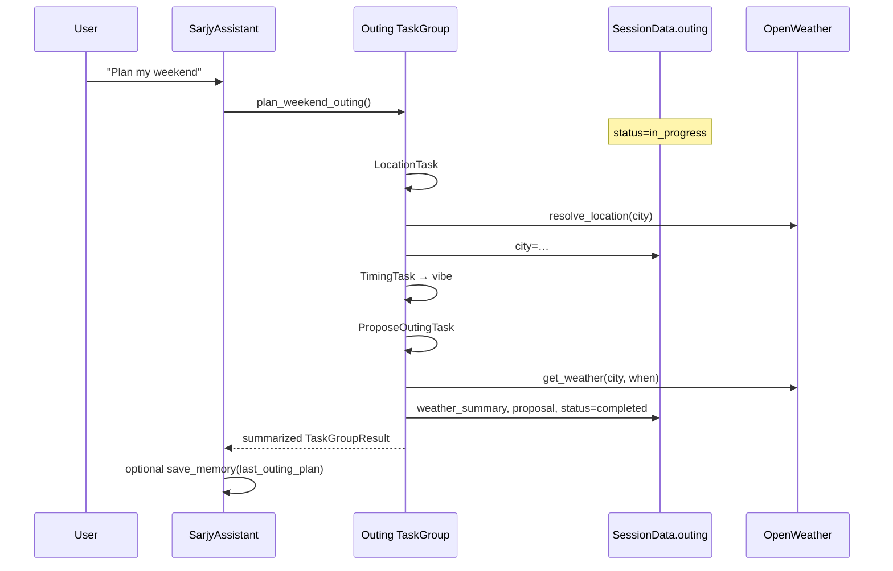

# Sarjy Agent

LiveKit Agents worker that runs Sarjy’s voice pipeline: STT → LLM → TTS (LiveKit Inference), function tools, and the weekend outing planner workflow. Dispatched into a room when a user joins via the frontend.

Does **not** mint tokens or own database — identity and persistence go through the FastAPI backend. Media and model inference go through LiveKit Cloud.

```text
Browser ◄── WebRTC ──► LiveKit Cloud ◄── dispatch ──► Agent worker
                              │
                              ├──► Backend (memories + history)
                              └──► OpenWeather (get_weather)
```

## Layout

```text
agent/
  agent.py                 # LiveKit entrypoint (AgentServer)
  settings.py
  schemas/                 # SessionData + outing typed results
  integrations/            # BackendApiClient, OpenWeatherClient
  assistants/              # SarjyAssistant + function tools
  workflows/outing/        # Weekend outing planner TaskGroup
  session/                 # history load, turn persistence, greeting
  prompts/                 # versioned prompt files
  tests/
```

## Tools

| Tool                           | Purpose                                    |
|--------------------------------|--------------------------------------------|
| `save_memory`                  | Upsert facts via the backend               |
| `recall_memories`              | List facts via the backend                 |
| `get_weather(location, when?)` | Current / near-term forecast (OpenWeather) |
| `plan_weekend_outing`          | Enter the Outing Planner TaskGroup         |

## Weekend outing planner

Trigger phrases (system prompt `1.3.0`): e.g. "plan my weekend", "help me plan an outing".

1. **Location**: resolve city (geocoding)
2. **Timing**: weekend day part
3. **Vibe**: outdoor / indoor / food / flexible
4. **Propose**: weather + 1–2 ideas; confirm may persist `last_outing_plan`

### Outing planner TaskGroup flow



Corrections ("change the city") use TaskGroup's built-in `out_of_scope` revisit tool — earlier visited steps are re-run; later weather uses the updated city from userdata (`SessionData.outing.city`).

## Prompts

Versioned under `prompts/{name}/{version}.md`.

```text
prompts/
  system/1.3.0.md            # default system (memory + weather + outing)
  outing_location/1.0.0.md
  outing_timing/1.0.0.md
  outing_vibe/1.0.0.md
  outing_propose/1.0.0.md
  greeting/1.0.0.md
  greeting_guest/1.0.0.md
```

Active versions are selected via settings (`SYSTEM_PROMPT_VERSION`, `GREETING_PROMPT_VERSION`).

## Setup

Prerequisites: Python 3.11+, [uv](https://docs.astral.sh/uv/), running backend (or full Compose), LiveKit + OpenWeather credentials in repo-root `.env`.

```bash
# from repo root
cp .env.example .env   # fill LIVEKIT_* and OPENWEATHER_API_KEY

# Full stack (agent joins when a user Starts in the UI)
make up

# Or worker alone against a local API
make api               # terminal 1
make agent             # terminal 2 — LiveKit `dev` mode
```

```bash
cd agent && uv run pytest -q

# Outing TaskGroup only (needs LiveKit credentials in .env)
cd agent && uv run pytest -q tests/test_outing_workflow.py
```

## Configuration

Settings load from repo-root `.env` (or `agent/.env`):

| Variable                                                 | Purpose                         | Default / notes                                          |
|----------------------------------------------------------|---------------------------------|----------------------------------------------------------|
| `LIVEKIT_URL` / `LIVEKIT_API_KEY` / `LIVEKIT_API_SECRET` | Worker auth + Inference         | required                                                 |
| `LIVEKIT_AGENT_NAME`                                     | Must match token dispatch name  | `sarjy`                                                  |
| `BACKEND_API_BASE_URL`                                   | FastAPI base for memory/history | `http://localhost:8000` (Compose: `http://backend:8000`) |
| `CONVERSATION_HISTORY_LIMIT`                             | Turns loaded on session start   | `20`                                                     |
| `OPENWEATHER_API_KEY`                                    | Weather tool                    | required                                                 |
| `SYSTEM_PROMPT_VERSION`                                  | System prompt file version      | `1.3.0`                                                  |
| `GREETING_PROMPT_VERSION`                                | Greeting prompt version         | `1.0.0`                                                  |
| `APP_ENV`                                                | Environment label               | `development`                                            |
