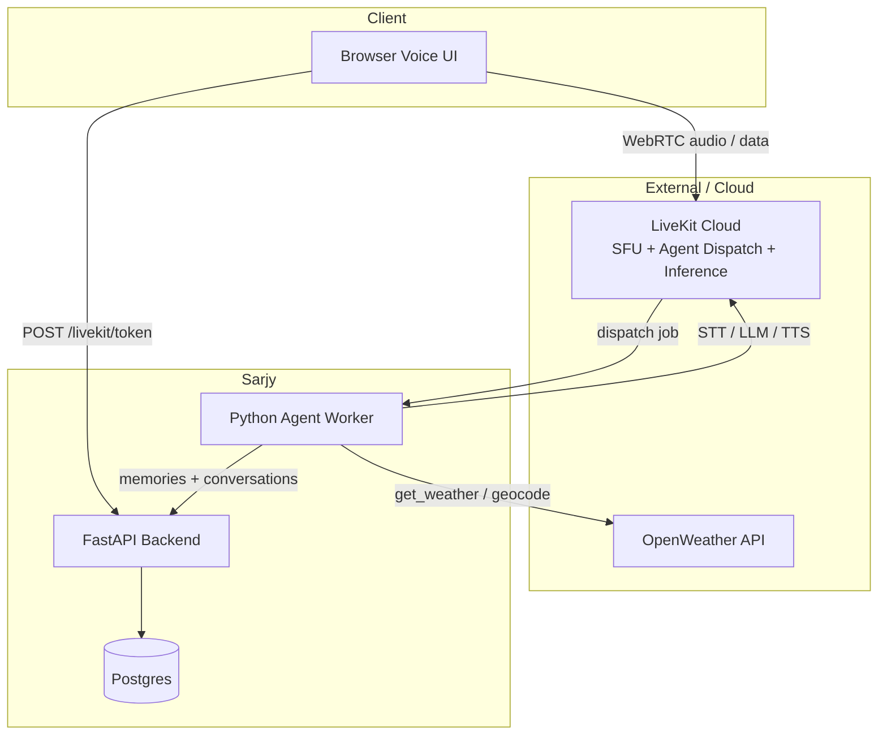
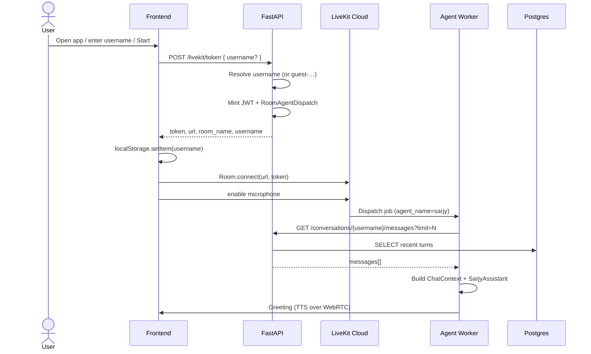
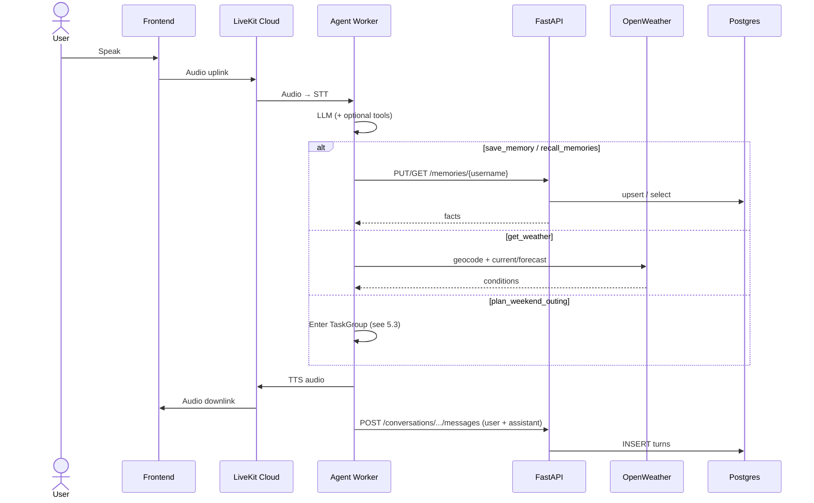
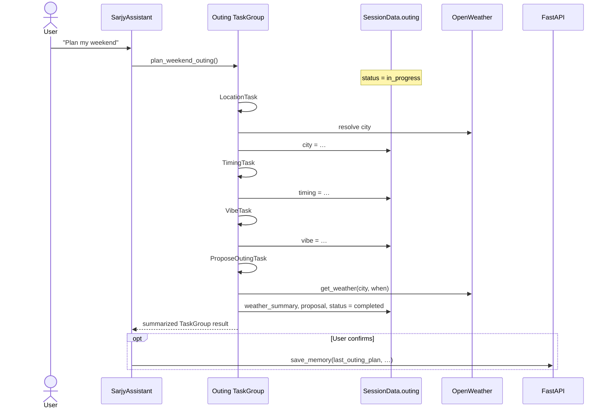

# Sarjy Architecture

Technical deep dive for Sarjy: how the system is structured, how requests flow end to end, what the data models mean, and why key design choices were made.

For clone-and-run instructions, see the root [README.md](README.md). Package-level detail lives in [frontend/README.md](frontend/README.md), [backend/README.md](backend/README.md), and [agent/README.md](agent/README.md).

---

## Table of contents

1. [Product summary](#1-product-summary)
2. [High-level architecture](#2-high-level-architecture)
3. [Major components](#3-major-components)
4. [End-to-end flows](#4-end-to-end-flows)
5. [Data models](#5-data-models)
6. [Agent internals](#6-agent-internals)
7. [Design decisions & rationale](#7-design-decisions--rationale)
8. [Further reading](#8-further-reading)

---

## 1. Product summary

Sarjy is a voice-first assistant that:

1. Listens and responds over WebRTC (LiveKit).
2. Remembers structured facts and recent conversation across browser sessions (Postgres via FastAPI).
3. Calls OpenWeatherMap for current and near-term conditions.
4. Runs a multistep weekend outing planner (LiveKit `TaskGroup`) when the user asks to plan an outing.

---

## 2. High-level architecture



### Responsibility split

| Layer         | Owns                                                                          | Does not own                   |
|---------------|-------------------------------------------------------------------------------|--------------------------------|
| Frontend      | Mic, speakers, username UX, LiveKit `Room` connect                            | Persistence, tools, LLM        |
| Backend       | JWT minting + agent dispatch metadata, CRUD for memory/history, DB migrations | Media path, model inference    |
| Agent         | Voice loop, tools, workflows, prompts, hydrate/persist chat                   | Token minting, Postgres schema |
| LiveKit Cloud | Rooms, SFU, dispatch, Inference models                                        | App business data              |
| Postgres      | Durable rows for facts and turns                                              | Realtime media                 |

Identity key everywhere: `username`. It is sanitized/generated at token mint time, embedded in the LiveKit participant + agent dispatch metadata, and used as the partition key for all persistence.

---

## 3. Major components

### 3.1 Frontend

Minimal Vite app using `livekit-client`.

- Restores or collects `username`.
- Calls `POST /livekit/token`.
- Connects with the returned JWT, enables the microphone, plays subscribed audio tracks.

API base defaults to `http://localhost:8000` (`window.SARJY_API_BASE` override). No framework; production image serves static assets via Nginx.

### 3.2 Backend

FastAPI application with routes:

- `POST /livekit/token`: public join path.
- `/memories/{username}`: upsert / list / clear facts.
- `/conversations/{username}`: append / list / clear turns.
- `/health`, `/ready`: liveness and DB readiness.

### 3.3 Agent worker

LiveKit Agents `AgentServer` entrypoint (`agent.py`):

1. Resolve `username` from job / participant metadata.
2. Load the last *N* conversation turns into a `ChatContext`.
3. Start `AgentSession` with LiveKit Inference STT → LLM → TTS.
4. Attach turn persistence listeners.
5. Run `SarjyAssistant` with tools and the outing workflow.

Layout:

```text
agent/
  agent.py              # entrypoint
  assistants/           # SarjyAssistant + @function_tool methods
  workflows/outing/     # TaskGroup + per-step AgentTasks
  session/              # history load, persistence, greeting
  integrations/         # BackendApiClient, OpenWeatherClient
  schemas/              # SessionData, outing results
  prompts/              # versioned Markdown + YAML front matter
```

### 3.4 Postgres

Two tables (see [Data models](#6-data-models)):

- `memories`: durable key/value facts per username.
- `conversation_messages`: append-only turn log per username.

### 3.5 LiveKit Cloud

- SFU / rooms: realtime audio between browser and agent.
- Agent dispatch: room config on the JWT names the worker (`LIVEKIT_AGENT_NAME`, default `sarjy`).
- Inference: STT / LLM / TTS without separate provider keys (current models are configured in `agent.py`).

### 3.6 OpenWeather

Used by:

- `get_weather` tool (ad-hoc questions).
- Outing location resolution (geocoding).
- Outing propose step (conditions for the chosen city + timing).

---

## 4. End-to-end flows

### 4.1 Session start



Notes:

- Room names are unique per session (`sarjy-{username}-{suffix}`) so dispatch runs reliably on join.
- `username` is the LiveKit participant identity and is mirrored in metadata for the worker.

### 4.2 General conversation turn



Persistence is hooked on `conversation_item_added` and runs asynchronously so saving history does not block the spoken reply path.

### 4.3 Weekend outing planner



Corrections (actually make it Cairo) use TaskGroup’s built-in revisit / `out_of_scope` behavior: earlier steps re-run; later steps (including weather) see updated `SessionData.outing` fields.

Cancel (never mind): raises `OutingCancelled` and returns cleanly to the main assistant without leaving orphaned `in_progress` state as the durable outcome.

---

## 5. Data models

### 5.1 Identity

Username is the stable string identity for a human (or guest):

Username is created by the backend `LiveKitTokenService` and sanitized to `[a-zA-Z0-9_-]`, max 64; blank → `guest-{hex}`. It is used as the JWT identity + metadata, agent `SessionData.username`, all persistence paths, and frontend `localStorage`.

### 5.2 Backend ORM

#### Memory table

| Field                       | Meaning                                                |
|-----------------------------|--------------------------------------------------------|
| `id`                        | UUID primary key                                       |
| `username`                  | Owner                                                  |
| `key`                       | Fact label (e.g. `favorite_color`, `last_outing_plan`) |
| `value`                     | Fact text                                              |
| `created_at` / `updated_at` | Audit timestamps                                       |

Used by: agent `save_memory` / `recall_memories` tools; optional persistence of a confirmed outing plan.

Represents: durable, structured preferences and facts the model should be able to recall across sessions without re-deriving them from free-form chat.

#### Conversation message table

| Field        | Meaning               |
|--------------|-----------------------|
| `id`         | UUID primary key      |
| `username`   | Owner                 |
| `role`       | `user` or `assistant` |
| `content`    | Turn text             |
| `created_at` | Ordering / pagination |

Used by: session start hydrate (list messages with limit); live persistence via append message.

Represents: chronological transcript for continuity — not a substitute for structured memory.

---

## 6. Agent internals

### 6.1 Voice pipeline

Configured in `agent.py` via LiveKit Inference (models may change over time):

```text
Audio in → STT → LLM (+ tools / TaskGroup) → TTS → Audio out
```

Turn handling (interruptions, false-interruption resume, etc.) is configured on `AgentSession` so the experience stays conversational rather than walkie-talkie.

### 6.2 Tools

| Tool                  | Side effects                | Why it exists                                                  |
|-----------------------|-----------------------------|----------------------------------------------------------------|
| `save_memory`         | Upsert fact in Postgres     | Explicit durable knowledge                                     |
| `recall_memories`     | Read all facts for username | On-demand recall without stuffing every fact into every prompt |
| `get_weather`         | OpenWeather HTTP            | External usefulness + outing grounding                         |
| `plan_weekend_outing` | Starts TaskGroup            | Structured multistep UX                                        |

### 6.3 Prompts

Versioned files under `agent/prompts/{name}/{version}.md` with YAML front matter, loaded by `load_prompt(name, version)`.

Active versions are settings-driven (`SYSTEM_PROMPT_VERSION`, `GREETING_PROMPT_VERSION`). Outing steps each have their own prompt so instructions stay focused per stage.

### 6.4 History hydrate & persist

```text
On job start:
  GET last CONVERSATION_HISTORY_LIMIT messages
  → ChatContext for SarjyAssistant

During session:
  conversation_item_added → async POST append
```

Only `user` / `assistant` text messages are persisted; empty or non-chat items are skipped.

---

## 7. Design decisions & rationale

### 7.1 Why preload only a subset of conversations

Decision: Load the most recent *N* turns (default 20, configurable via `CONVERSATION_HISTORY_LIMIT`), not the full history.

Why?

- Latency: Session start waits on a larger DB read and a larger initial context build.
- Cost / tokens: Every LLM turn pays for prior context; unbounded history grows cost linearly.
- Relevance: Very old turns rarely help the current utterance and can distract the model.
- Voice UX: Users expect a fast greeting; blocking on megabytes of history hurts first response.

Trade-off: The agent may not remember a detail from turn 200 unless it was also saved as a memory fact. That is intentional — transcripts are continuity, memories are durable knowledge.

Future: summarization of older turns, or retrieval over history, without injecting the full raw log into every call.

### 7.2 Why a dedicated memory layer

Decision: Separate `memories` (key/value facts) from `conversation_messages` (turns).

Why?

- Different write patterns: facts upsert by key; turns append chronologically.
- Different read patterns: recall is "what do we know about this user?" not "replay the chat."
- Model control: the LLM (via tools) decides *when* to save or recall, instead of dumping every past message into the system prompt.
- Demo clarity: "favorite color" survives refresh even if history window has scrolled past that utterance.

Trade-offs:

- Cross-session preferences without huge contexts: extra tool round-trips vs always-on RAG.

Production note: Today `recall_memories` returns the full set for a user. At larger scale, prefer keyed get / semantic retrieval so recall stays cheap and precise.

### 7.3 Why LiveKit Agents + Inference

Why?

- Voice agents need turn detection, interruption handling, room lifecycle, and worker dispatch — LiveKit provides these as primitives.
- Inference keeps STT/LLM/TTS behind LiveKit credentials, reducing free-tier key sprawl.
- Cloud SFU avoids operating WebRTC infrastructure for a demo / early product.

Trade-offs:

- Dependency on LiveKit Cloud and Inference model availability, swapping providers means changing session construction, not the whole architecture.

### 7.4 Why FastAPI beside the agent

Why?

- Token minting must be reachable by the browser; the agent should not expose a public HTTP surface for that.
- A shared HTTP API lets multiple agent workers share one persistence layer.
- Clear security boundary: public token route vs private memory/history routes (see production section in the README).

Trade-offs:

- Extra network hop for every memory/history call vs in-process DB access.

### 7.5 Why TaskGroup for the outing planner

LiveKit `Tasks` / `TaskGroup` give:

- Ordered steps with typed results.
- Shared userdata.
- Built-in correction / revisit semantics.
- Natural place for tool use (weather) in the final step.

A single prompt that "asks everything" is harder to test, harder to demo, and worse at corrections ("change only the city").

### 7.6 Why OpenWeather

Weekend plans are weak without weather. OpenWeather is:

- Free-tier friendly.
- Low-ambiguity (good tool-calling target).
- Useful both as a standalone tool and inside the planner.

We intentionally avoided calendar OAuth, payments, or multi-city logistics — scope is "useful external API + workflow," not a travel agency.

### 7.7 What we explicitly cut

- Self-hosted LiveKit
- Production-grade auth / multi-tenant isolation
- Multiple competing workflows
- Always-on full-history context windows

---

## 8. Further reading

- [README.md](README.md) | Quick start, Makefile, future improvements
- [agent/README.md](agent/README.md) | Tools, prompts, outing flow
- [backend/README.md](backend/README.md) | API surface and layout
- [frontend/README.md](frontend/README.md) | Join UX and token flow
- [LiveKit Agents docs](https://docs.livekit.io/agents/) | Framework primitives
